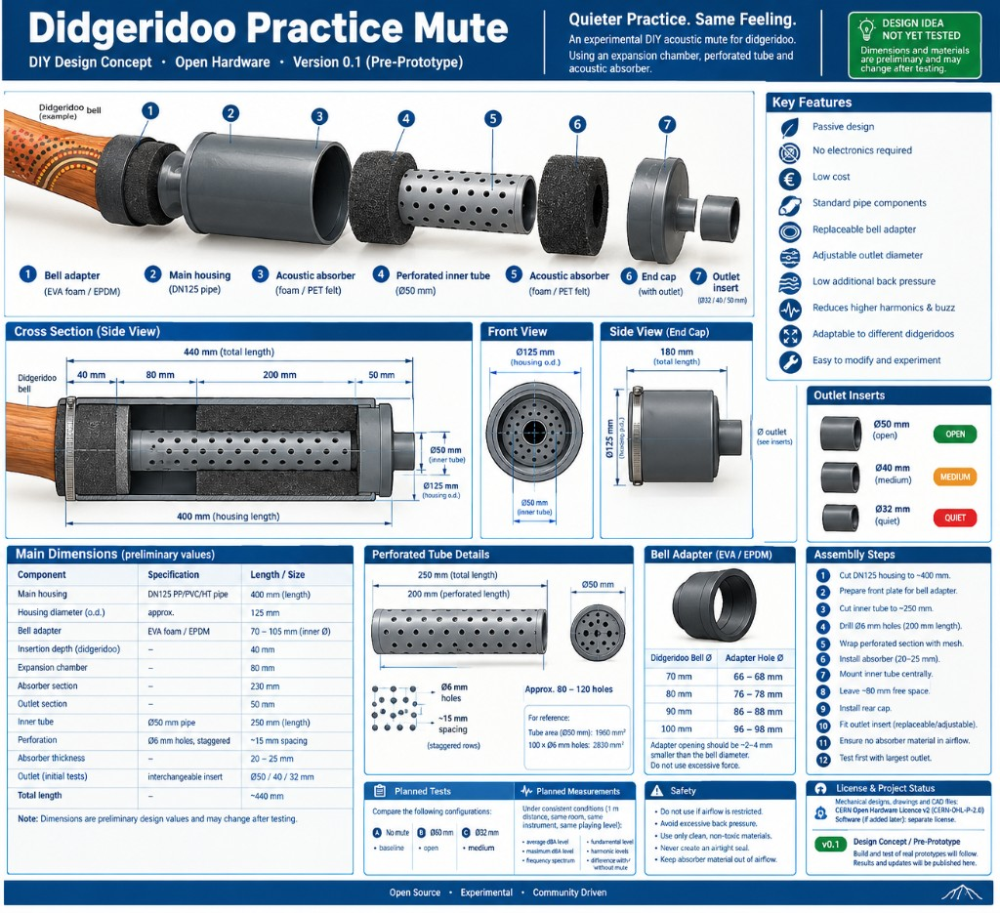

<p align="center">
  
</p>

<h1 align="center">Didgeridoo Practice Mute</h1>

<p align="center"><strong>Quieter practice. More music.</strong></p>

<p align="center">DIY Design Concept · Open Hardware · Version 0.1 (Pre-Prototype)</p>

<p align="center">
  <a href="./README.md">English</a> ·
  <a href="./README_DE.md">Deutsch</a>
</p>

An experimental DIY acoustic mute for quieter didgeridoo practice.

The proposed design uses an **expansion chamber, a perforated inner tube and acoustic absorber** instead of simply closing the bell. Air still leaves through a replaceable outlet, so playing feel should stay closer to the open instrument than with a blocked plug.

> This is an experimental DIY practice mute. It will not make a didgeridoo completely silent.

> [!IMPORTANT]
>
> ## Design idea / pre-prototype
>
> **This English documentation describes a design idea. It has not been tested yet.**
>
> Dimensions and materials are **preliminary** and may change after practical testing.
>
> The next stage of the project will include:
>
> * construction of one or more prototypes
> * subjective evaluation of playing feel and back pressure
> * sound-level measurements with and without the mute
> * comparison of outlet diameters Ø50 / Ø40 / Ø32 mm
> * testing of different absorber materials
> * frequency-spectrum measurements where possible
> * optimization of dimensions based on the results
>
> **Experimental results and revised blueprints will be published in this repository.**
>
> Current status: **Version 0.1 — Concept / Pre-Prototype**, not a finished or validated design.

The German README currently documents a **compact DN75 variant**. This English README follows the English construction plan below (**DN125, v0.1**).

---

## Current project status

**Status:** Design idea / pre-prototype  
**Version:** 0.1  
**Construction plan:** DN125 housing, overall length ~440 mm

The English drawing is the source of truth for parts and dimensions in this file.

---

## Features intended by the design

* Passive design
* No electronics required
* Low cost
* Standard pipe components
* Replaceable bell adapter
* Adjustable outlet diameter
* Low additional back pressure
* Reduction of higher harmonics and buzz
* Adaptable to different didgeridoos
* Easy to modify and experiment

---

## How it is intended to work

A didgeridoo produces a strong low-frequency fundamental together with many harmonics.

Simply blocking the bell reduces volume, but also greatly increases back pressure and changes the instrument.

The proposed design therefore uses three acoustic stages:

1. **Expansion chamber**  
   Air leaving the didgeridoo first enters a larger chamber (about 80 mm).

2. **Perforated inner tube**  
   The airflow then continues through a Ø50 mm perforated tube. Acoustic energy can pass through the holes into the surrounding absorber.

3. **Acoustic absorber**  
   Open-cell acoustic foam or PET felt is intended to absorb part of the energy, especially at higher frequencies.

The exhaust remains open so that airflow can continue through the system.

This operating principle is plausible, but its effectiveness in this exact configuration still needs to be verified.

---

# Construction plan

<p align="center">
  
</p>

<p align="center"><em>English construction plan v0.1 — DN125 design concept / pre-prototype. Dimensions are preliminary and may change after testing.</em></p>

Exploded parts on the drawing:

1. Bell adapter (EVA foam / EPDM)
2. Main housing (DN125 pipe)
3. Acoustic absorber (foam / PET felt)
4. Perforated inner tube (Ø50 mm)
5. Acoustic absorber (foam / PET felt)
6. End cap (with outlet)
7. Outlet insert (Ø32 / Ø40 / Ø50 mm)

On the end-cap side view the drawing also prints **180 mm (total length)**. That label does not match the cross section or the dimension table (**400 mm housing / ~440 mm overall**). This README uses the cross section and the main-dimensions table.

---

## Main dimensions (preliminary values)

| Component | Specification | Length / size |
| --------- | ------------- | ------------- |
| Main housing | DN125 PP/PVC/HT pipe | **400 mm** |
| Housing diameter (o.d.) | approx. | **125 mm** |
| Bell adapter | EVA foam / EPDM | **70–105 mm** inner Ø |
| Insertion depth (didgeridoo) | | **40 mm** |
| Expansion chamber | | **80 mm** |
| Absorber section | | **230 mm** |
| Outlet section | | **50 mm** |
| Inner tube | Ø50 mm pipe | **250 mm** |
| Perforation | Ø6 mm holes, staggered | **~15 mm** spacing |
| Absorber thickness | | **20–25 mm** |
| Outlet (initial tests) | interchangeable insert | **Ø50 / Ø40 / Ø32 mm** |
| Total length | | **~440 mm** |

**These dimensions are preliminary design values and may change after testing.**

---

## Proposed cross section

```text
 DIDGERIDOO                         PRACTICE MUTE

       Bell
        /\     40 mm    80 mm         200 mm            50 mm
=======/  \====================================================
      \    / |                   ___________________
       \__/  |                  /                   \
      EVA    |                 |   Acoustic foam     |
      adapter|                 |  ################   |
             |                 |  # ............ #   |
             |                 |  # : Ø50 tube  : #---+----> OUT
             |                 |  # :perforated : #   |
             |                 |  # ............ #   |
             |                 |  ################   |
             |                  \___________________/
===============================================================
             <----------- DN125 / 400 mm housing ------------>
             <-------------- ~440 mm total length ----------->
```

---

# Proposed materials

| Part | Description |
| ---- | ----------- |
| Main tube | DN125 HT/PP/PVC pipe |
| Rear cap | DN125 end cap |
| Inner tube | Ø50 mm PP/PVC pipe |
| Bell adapter | EVA foam, EPDM or similar |
| Absorber | PET acoustic felt or open-cell acoustic foam |
| Protective mesh | Nylon or stainless steel mesh |
| Sealant | Neutral silicone, polyurethane adhesive or similar |
| Outlet insert | PVC/PP disc or pipe reducer, Ø50 / Ø40 / Ø32 mm |

Loose glass wool or mineral wool should not be used, because fibres could enter the airflow.

---

# Bell adapter (EVA / EPDM)

The didgeridoo should not be clamped directly against hard plastic.

A flexible EVA or EPDM adapter is proposed to provide sealing, isolation, protection of the instrument, and adaptation to different bell sizes.

The adapter opening should be about **2–4 mm smaller** than the bell diameter. Do not use excessive force.

| Didgeridoo bell Ø | Adapter hole Ø |
| ----------------: | -------------: |
|            70 mm |       66–68 mm |
|            80 mm |       76–78 mm |
|            90 mm |       86–88 mm |
|           100 mm |       96–98 mm |

These dimensions will need to be verified with different bell shapes and materials.

---

# Perforated inner tube

From the construction plan:

* outside diameter: **Ø50 mm**
* length: **250 mm**
* perforated length: **200 mm**
* hole diameter: **Ø6 mm**
* hole spacing: approximately **15 mm**
* staggered rows
* approximately **80–120 holes**

```text
   o     o     o
      o     o
   o     o     o
```

For reference:

```text
Ø50 mm tube area ≈ 1960 mm²
100 × Ø6 mm holes ≈ 2830 mm²
```

This should keep the perforations from becoming a major airflow restriction. Actual pressure behaviour still needs to be measured.

---

# Adjustable outlet — experimental values

Three interchangeable inserts are proposed for the first prototype tests:

| Test | Outlet | Expected behaviour |
| ---- | -----: | ------------------ |
| OPEN | Ø50 mm | lowest restriction |
| MEDIUM | Ø40 mm | intermediate |
| QUIET | Ø32 mm | more attenuation, probably more back pressure |

These descriptions are **expectations only**. No noise-reduction figure in dB is claimed on the English construction plan.

The actual relationship between attenuation and back pressure will be measured during prototype testing.

Do not close the outlet completely. Free airflow matters for playing feel and safety.

---

# Assembly

1. Cut the DN125 housing to approximately **400 mm**.
2. Prepare the front plate for the didgeridoo bell adapter.
3. Cut the Ø50 mm inner tube to approximately **250 mm**.
4. Drill Ø6 mm holes over approximately **200 mm**.
5. Wrap the perforated section with thin protective mesh.
6. Install approximately **20–25 mm** of acoustic absorber.
7. Mount the inner tube centrally inside the main housing.
8. Leave approximately **80 mm of free expansion space** behind the didgeridoo bell.
9. Install the rear cap.
10. Fit a replaceable or adjustable outlet insert.
11. Ensure that absorber material cannot enter the airflow.
12. Begin experimental testing with the **largest** outlet (Ø50 mm).

---

# Planned prototype tests

The drawing compares:

```text
Test A: no mute          (baseline)
Test B: Ø50 mm outlet    (open)
Test C: Ø40 mm outlet    (medium)
Test D: Ø32 mm outlet    (quiet)
```

The printed test block on the sheet labels A / Ø50 / Ø32. The outlet-insert panel also includes **Ø40 mm (medium)**, so all three inserts should be tested.

For each configuration, document:

* perceived volume
* playing comfort
* back pressure
* response of the fundamental note
* ease of circular breathing
* effect on vocalizations
* effect on harmonics
* condensation behaviour

---

# Planned acoustic measurements

Prefer constant conditions, for example:

```text
Distance:       1 metre
Microphone:     same position
Room:           same room
Instrument:     same didgeridoo
Playing level:  as consistent as possible
```

Useful measurements:

* average dBA
* maximum dBA
* frequency spectrum
* fundamental level
* harmonic levels
* difference with and without the mute

Repeat measurements where possible.

---

# Acoustic expectations

At this stage **no specific noise-reduction figure is claimed**.

The design is expected to affect higher harmonics more easily than the very low fundamental.

Possible reductions may occur in:

* buzzing
* higher harmonics
* attack noise
* breath noise
* perceived brightness
* overall subjective loudness

Effectiveness is hypothetical until prototype measurements are available.

Any future dB figures published here will be identified as **measured results**, not design estimates.

---

# Safety

This project is experimental.

Do not use the device if:

* airflow becomes severely restricted
* breathing feels uncomfortable
* excessive back pressure develops
* parts become loose
* absorber material can enter the airflow

Use only clean, non-toxic materials near the airflow path.

Never create an airtight seal.

---

# Cleaning

The design should remain serviceable and removable.

Because condensation is expected during playing:

* allow the device to dry after use
* use removable absorber material where practical
* clean the inner tube periodically
* inspect for mould or contamination
* replace contaminated absorber material

---

# Planned development

Possible later versions may investigate:

* adjustable iris outlet
* interchangeable absorber cartridges
* 3D-printed bell adapters
* different expansion-chamber volumes
* different housing diameters, including the compact DN75 variant in the German documentation
* Helmholtz resonators
* quarter-wave resonators
* multi-stage absorber chambers
* internal baffles
* condensation collection
* optimized low-back-pressure variants

---

# Development stages

```text
v0.1  Design concept / preliminary blueprint   ← current
 ↓
v0.2  First physical prototype
 ↓
v0.3  Initial acoustic measurements
 ↓
v0.4  Geometry and absorber optimization
 ↓
v0.5  Second-generation prototype
 ↓
v1.0  Tested and documented design
```

This roadmap may change depending on experimental results.

---

# Contributing

Experiments and independent prototypes are welcome.

Especially useful contributions include:

* photos of prototypes
* SPL measurements
* frequency-spectrum measurements
* back-pressure measurements
* tests with different absorber materials
* alternative dimensions
* 3D-printable components
* tests with different didgeridoos

Please distinguish **design assumptions**, **subjective observations** and **measured results**.

---

# Disclaimer

This repository currently contains an **experimental design concept**, not a validated finished product.

The design has not been certified as a medical, acoustic or safety device.

Use of any prototype is at your own risk.

No guarantee is provided regarding:

* acoustic attenuation
* mechanical safety
* breathing resistance
* playing characteristics
* compatibility with individual instruments

---

# License

Mechanical designs, drawings and CAD files are licensed under the **CERN Open Hardware Licence Version 2 – Permissive (CERN-OHL-P-2.0)**.

That matches the construction plan and the **Open Hardware** mark on the project logo.

Software added later may use a separate software licence.

See [`LICENSE`](./LICENSE).

---

## Files

| File | Role |
| ---- | ---- |
| [`docs/logo.png`](./docs/logo.png) | Project logo (transparent) |
| [`docs/logo.jpg`](./docs/logo.jpg) | Project logo (original artwork) |
| [`docs/construction-plan-en.jpg`](./docs/construction-plan-en.jpg) | English construction plan v0.1 (DN125) |
| [`docs/construction-plan.png`](./docs/construction-plan.png) | German construction plan (compact DN75 variant) |
| [`README.md`](./README.md) | English documentation |
| [`README_DE.md`](./README_DE.md) | German documentation |
| [`LICENSE`](./LICENSE) | CERN-OHL-P-2.0 |

**Open source · Experimental · Community driven.** Results, failures, modifications and updated blueprints will be documented in this repository.
