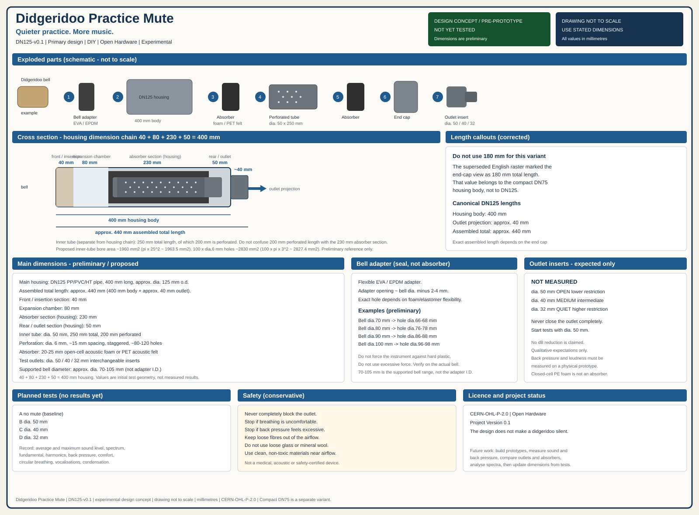
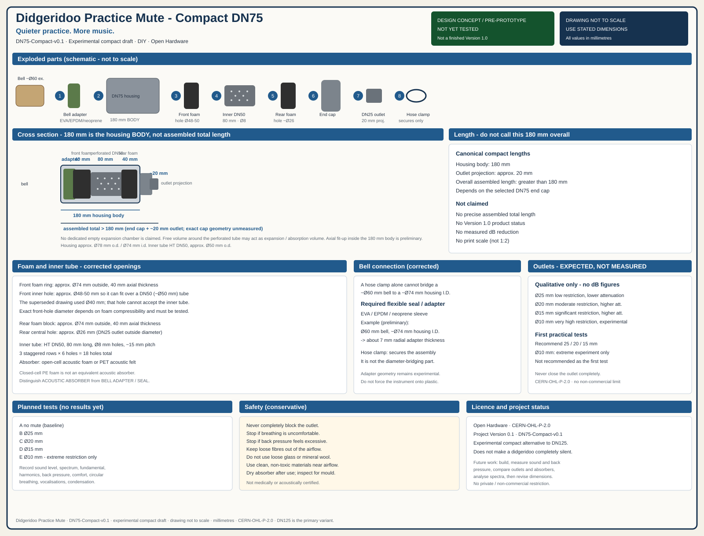

<p align="center">
  
</p>

<h1 align="center">Didgeridoo-Übungsdämpfer</h1>

<p align="center"><strong>Leiser üben. Mehr Musik.</strong></p>

<p align="center">Projektversion 0.1 · DIY · Open Hardware · Experimentell</p>

<p align="center">
  <a href="./README.md">English</a> ·
  <a href="./README_DE.md">Deutsch</a>
</p>

Ein experimenteller DIY-Schalldämpfer für leiseres Didgeridoo-Üben.

Die vorgeschlagenen Konstruktionen verwenden **Expansions-/Absorptionsvolumen, ein perforiertes Innenrohr und akustischen Absorber**, statt die Glocke einfach zu verschließen. Die Luft verlässt das Gerät durch einen offenen Auslass.

> Das ist ein experimenteller Übungsdämpfer. **Ein Didgeridoo wird dadurch nicht vollständig lautlos.** Das durchgestrichene Lautsprecher-Symbol im Logo bedeutet „leiser / gedämpft“, nicht Stille.

> [!IMPORTANT]
>
> ## Designidee / Vorprototyp
>
> **Noch nicht praktisch getestet.**
>
> Dieses Repository beschreibt experimentelle Designideen. Ein physischer Prototyp genau dieser Zeichnungen wurde hier noch nicht gemessen. Maße und Materialien sind **vorläufig** und können sich nach praktischen Versuchen ändern.
>
> Geplante weitere Arbeit:
>
> * Bau physischer Prototypen
> * Schallpegelmessungen
> * Messung oder Beurteilung des Gegendrucks
> * Vergleich der Auslassgrößen
> * Versuche mit Absorbermaterialien
> * Auswertung von Frequenzspektren
> * Aktualisierung der Maße anhand realer Versuche
>
> **Qualitative Lautstärkeformulierungen sind keine Messergebnisse.**

---

## Variantenübersicht

Dieses Projekt enthält **zwei getrennte experimentelle Varianten**. Die deutsche Datei ist **keine** reine Übersetzung einer nur-DN75-Beschreibung.

| Variante | Status | Gehäuse | Körperlänge | Montagelänge | Zweck |
| -------- | ------ | ------- | ----------- | ------------ | ----- |
| **DN125 v0.1** | Primärer Vorprototyp · noch nicht getestet | DN125 | 400 mm | ca. 440 mm | Hauptexperiment mit möglichst geringem Gegendruck |
| **DN75 Compact v0.1** | Experimenteller Kompaktentwurf · noch nicht getestet | DN75 | 180 mm **Körper** | größer als 180 mm (Endkappe + Auslass; genaue Gesamtlänge ungemessen) | kleinere experimentelle Alternative |

**DN125-v0.1 ist die maßgebliche Projektkonstruktion.** DN75-Compact-v0.1 ist ein kompakter Entwurf, kein fertiges Produkt in Version 1.0.

---

# Primärkonstruktion — DN125 v0.1

**Name:** DN125 Practice Mute  
**Status:** Version 0.1 · Designidee / Vorprototyp · **noch nicht praktisch getestet**

## Konstruktionsplan

<p align="center">
  
</p>

<p align="center"><em>DN125-v0.1 · Zeichnung nicht maßstäblich — angegebene Millimetermaße verwenden · CERN-OHL-P-2.0</em></p>

## Funktionsprinzip (DN125)

1. **Vorderer Einsteckbereich (40 mm)**  
   Ein flexibler **Glockenadapter / Dichtung** (EVA oder EPDM) koppelt das Didgeridoo. Das ist eine **Dichtung**, kein akustischer Absorber.

2. **Expansionskammer (80 mm)**  
   Die Luft gelangt zuerst in einen größeren Raum.

3. **Absorberbereich (230 mm Gehäuselänge)**  
   Darin liegt ein Ø50-mm-Innenrohr. **200 mm des Rohrs sind perforiert**; die **Gesamtlänge des Rohrs beträgt 250 mm**. Diese beiden Werte sind nicht identisch mit den 230 mm Absorberlänge im Gehäuse.

4. **Hinterer Auslassbereich (50 mm) und Auslassüberstand (ca. 40 mm)**  
   Ein austauschbarer Einsatz (Ø50 / Ø40 / Ø32 mm) hält den Luftweg offen.

## DN125-Maße (vorläufig)

Gehäusekette:

**40 + 80 + 230 + 50 = 400 mm** Gehäusekörper.

| Position | Vorläufiger Wert |
| -------- | ---------------- |
| Hauptgehäuse | DN125-PP/PVC/HT-Rohr |
| Gehäusekörperlänge | **400 mm** |
| Gehäuseaußendurchmesser | ca. **125 mm** |
| Auslassüberstand außerhalb des Gehäuses | ca. **40 mm** |
| Ungefähre montierte Gesamtlänge | **440 mm** |
| Vorderer Einsteckbereich | **40 mm** |
| Expansionskammer | **80 mm** |
| Absorberbereich (Gehäuse) | **230 mm** |
| Hinterer Auslassbereich (Gehäuse) | **50 mm** |
| Innenrohr | **Ø50 mm**, Gesamtlänge **250 mm** |
| Perforierte Länge des Innenrohrs | **200 mm** |
| Bohrungen | Ø6 mm, Raster ca. 15 mm, versetzt, ca. 80–120 Löcher |
| Akustischer Absorber | 20–25 mm **offenporiger Akustikschaum oder PET-Akustikfilz** |
| Testauslässe | **Ø50 / Ø40 / Ø32 mm** |

Unterstützter **Didgeridoo-Glockendurchmesser:** ca. **70–105 mm**.

Dieser Bereich ist **nicht** der Innendurchmesser des Adapters.

**Adapteröffnung:** ca. Glockendurchmesser minus **2–4 mm**. Das genaue Maß hängt von der Nachgiebigkeit von Schaum oder Elastomer ab und muss erprobt werden.

| Glocke Ø | Vorgesehene Adapteröffnung Ø |
| -------: | ---------------------------: |
|   70 mm |                     66–68 mm |
|   80 mm |                     76–78 mm |
|   90 mm |                     86–88 mm |
|  100 mm |                     96–98 mm |

Kein übermäßiger Kraftaufwand. Das Instrument nicht gegen harten Kunststoff klemmen.

### Innenrohr-Querschnitt (nur Geometrie)

```text
Rohr Ø50 mm     π × 25² ≈ 1963,5 mm²   (dokumentiert als ~1960 mm²)
100 × Ø6-mm-Löcher  100 × π × 3² ≈ 2827,4 mm²  (dokumentiert als ~2830 mm²)
```

Diese Zahlen vergleichen nur Lochfläche und Rohrquerschnitt. Es sind **keine** akustischen Messergebnisse.

## DN125-Materialien

| Teil | Rolle | Vorgeschlagenes Material |
| ---- | ----- | ------------------------ |
| Glockenadapter | **Dichtung / mechanischer Adapter** | EVA oder EPDM |
| Hauptgehäuse | Struktur | DN125-HT/PP/PVC, 400 mm |
| Innenrohr | Luftweg + Perforation | Ø50-mm-PP/PVC, 250 mm |
| Akustischer Absorber | **Akustischer Absorber** | offenporiger Akustikschaum oder PET-Akustikfilz, 20–25 mm |
| Schutznetz | Absorber vom Luftstrom fernhalten | Nylon oder Edelstahlgewebe |
| Endkappe | hinterer Abschluss | DN125-Kappe |
| Auslasseinsatz | offener Ausgang | Ø50 / Ø40 / Ø32 mm |
| Dichtstoff | Fugen | neutrales Silikon o. Ä. |

Keine lose Glas- oder Steinwolle. Geschlossenzelliger PE-Schaum ist **kein** gleichwertiger akustischer Absorber.

## DN125-Zusammenbau (vorgeschlagen)

1. DN125-Gehäuse auf ca. **400 mm** schneiden.
2. Vorderseite für den EVA/EPDM-Glockenadapter vorbereiten.
3. Ø50-mm-Innenrohr auf ca. **250 mm** schneiden.
4. Über ca. **200 mm** Ø6-mm-Bohrungen (versetzt) anbringen.
5. Perforierten Bereich mit dünnem Schutznetz umwickeln.
6. Ca. **20–25 mm** Absorber im **230 mm** Absorberbereich einbauen.
7. Innenrohr mittig lagern.
8. Ca. **80 mm** Expansionskammer hinter der Glocke lassen.
9. Endkappe montieren.
10. Austauschbaren Auslasseinsatz einsetzen.
11. Sicherstellen, dass kein Absorber in den Luftweg gelangt.
12. Versuche mit dem **größten** Auslass beginnen (**Ø50 mm**).

## Geplante DN125-Versuche

Es liegen noch keine Ergebnisse vor.

```text
A  ohne Dämpfer
B  Ø50 mm
C  Ø40 mm
D  Ø32 mm
```

Bei jedem Versuch vorgesehen aufzuzeichnen:

* durchschnittlicher Schallpegel
* maximaler Schallpegel
* Frequenzspektrum
* Pegel des Grundtons
* Pegel der Obertöne
* subjektiver Gegendruck
* Spielkomfort
* Zirkularatmung
* Stimmeinsatz
* Kondenswasserverhalten

Auslassformulierungen sind **erwartetes Verhalten, nicht gemessen**:

| Auslass | Erwarteter Widerstand | Erwartete Dämpfung |
| ------: | --------------------- | ------------------ |
| Ø50 mm | geringer | geringer |
| Ø40 mm | mittel | mittel |
| Ø32 mm | höher | höher |

Den Auslass niemals vollständig verschließen.

---

# Kompaktkonstruktion — DN75 Compact v0.1

**Name:** Compact DN75 Practice Mute  
**Status:** Version 0.1 · Experimenteller Kompaktentwurf / Vorprototyp · **noch nicht praktisch getestet**

Das ist **kein** ausgereiftes Produkt in Version 1.0.

## Konstruktionsplan

<p align="center">
  
</p>

<p align="center"><em>DN75-Compact-v0.1 · Zeichnung nicht maßstäblich — angegebene Millimetermaße verwenden · CERN-OHL-P-2.0</em></p>

## Kompakter Aufbau (keine eigene leere Expansionskammer)

Die Kompaktzeichnung definiert **keine** separate leere 40-mm-Expansionskammer. Beschreiben als:

* vordere Glockenadapter- / Schaumstoffpartie
* perforiertes DN50-Innenrohr
* Absorber um das Innenrohr bzw. daneben
* hintere Schaumstoffpartie
* offener Auslass

Verbleibendes freies Volumen um das perforierte Innenrohr **kann** als Expansions-/Absorptionsvolumen wirken. Das ist eine vorläufige Beschreibung, keine gemessene Kammer.

## DN75-Maße (vorläufig)

| Position | Vorläufiger Wert |
| -------- | ---------------- |
| Hauptgehäuse | HT-**DN75** |
| Gehäuse-**körperlänge** | **180 mm** |
| typischer Außendurchmesser | ca. **78 mm** |
| typischer Innendurchmesser | ca. **74 mm** |
| Auslassüberstand | ca. **20 mm** |
| montierte Gesamtlänge | **hängt von der gewählten DN75-Endkappe ab; größer als 180 mm** |
| Innenrohr | HT-DN50, ca. Ø50 mm AD, Länge **80 mm** |
| Innenrohrbohrungen | Ø8 mm, Raster ca. 15 mm, 3 versetzte Reihen, 6 Löcher/Reihe, **18 Löcher** |
| vorderer Schaumring | außen ca. Ø74 mm, 40 mm dick, Innenloch **ca. Ø48–50 mm** |
| hinterer Schaumblock | außen ca. Ø74 mm, 40 mm dick, Mittelloch **ca. Ø26 mm** |
| Auslass | DN25, innen ca. Ø20 mm / außen ca. Ø26 mm, 20 mm Überstand |

**Die fertig montierte Baugruppe nicht als 180 mm lang bezeichnen.** 180 mm ist der DN75-**Gehäusekörper**.

Das vordere Schaumloch muss über das DN50-Rohr passen. Ein Ø40-mm-Loch ist **nicht** mit einem ca. Ø50-mm-Rohr kompatibel. **Ca. Ø48–50 mm** verwenden; der genaue Durchmesser hängt von der Stauchbarkeit des Schaums ab und muss erprobt werden.

Das hintere Schaumloch **ca. Ø26 mm** entspricht dem Außendurchmesser des DN25-Auslasses.

### Kompakte Glockenanbindung

Eine Schlauchschelle **allein** kann eine Glocke von grob Ø60 mm nicht an eine Gehäuse-ID von grob Ø74 mm anbinden.

Zusätzlich eine flexible **Glockenadapter- / Dichtungshülse** (EVA / EPDM / Neopren) vorsehen.

Beispiel (vorläufig): Glocke Ø60 mm und Gehäuse-ID ca. Ø74 mm → etwa **7 mm radiale Adapterdicke**.

Die Schlauchschelle **sichert** die Baugruppe. Sie überbrückt den Durchmesserunterschied nicht allein.

Die genaue Adaptergeometrie bleibt experimentell.

## DN75-Materialien

| Teil | Rolle | Vorgeschlagenes Material |
| ---- | ----- | ------------------------ |
| Glockenadapter / Hülse | **Dichtung / mechanischer Adapter** | EVA, EPDM oder Neopren |
| Schlauchschelle | sichert die Verbindung | Edelstahl, passende Größe |
| Hauptgehäuse | Struktur | HT-DN75, **180 mm Körper** |
| vorderer Schaumring | **akustischer Absorber** vorn | offenporiger Akustikschaum oder PET-Filz |
| Innenrohr | Luftweg + Perforation | HT-DN50, 80 mm |
| hinterer Schaumblock | **akustischer Absorber** hinten | offenporiger Akustikschaum oder PET-Filz |
| Endkappe | hinterer Abschluss | HT-DN75-Kappe |
| Auslass | offener Ausgang | HT-DN25, 20 mm Überstand |

## DN75-Zusammenbau (vorgeschlagen)

1. DN75-Gehäusekörper auf **180 mm** schneiden.
2. EVA/EPDM/Neopren-Glockenadapter / Dichtungshülse anbringen.
3. DN50-Innenrohr auf **80 mm** schneiden und Ø8-mm-Löcher bohren (3 × 6).
4. **Vorderen Schaum** auf ca. **Ø48–50 mm** öffnen und auf das Innenrohr schieben.
5. Innenrohr mit vorderem Schaum ins Gehäuse setzen.
6. **Hinteren Schaum** mit ca. **Ø26 mm** Loch einsetzen.
7. DN75-Endkappe kleben oder dichten.
8. **20 mm** DN25-Auslass einsetzen.
9. Schlauchschelle um Adapter/Gehäuse — zum Sichern, nicht zum Überbrücken der Glockendifferenz allein.
10. Versuche mit dem **größten** empfohlenen Auslass beginnen (**Ø25 mm**).

## Geplante DN75-Versuche

Es liegen noch keine Ergebnisse vor.

```text
A  ohne Dämpfer
B  Ø25 mm
C  Ø20 mm
D  Ø15 mm
E  Ø10 mm   nur extremes Drosselexperiment
```

Für die ersten praktischen Versuche **25 / 20 / 15 mm** empfehlen.

**Ø10 mm** ist eine extreme experimentelle Drossel. Wegen erwartetem hohem Gegendruck **nicht** als ersten Test empfohlen.

**ERWARTETES VERHALTEN — NICHT GEMESSEN**

| Auslass | Erwarteter Widerstand | Erwartete Dämpfung |
| ------: | --------------------- | ------------------ |
| 25 mm | gering | geringer |
| 20 mm | mäßig | höher |
| 15 mm | deutlich | höher |
| 10 mm | sehr hoch | nur experimentell |

Diese Tabelle nicht als nachgewiesene Tatsache darstellen.

Dieselben Beobachtungen wie bei DN125 aufzeichnen (Pegel, Spektrum, Gegendruck, Komfort, Zirkularatmung, Stimme, Kondenswasser).

---

# Messmethodik (beide Varianten)

Möglichst konstante Bedingungen, zum Beispiel:

```text
Abstand:        1 Meter
Mikrofon:       gleiche Position
Raum:           gleicher Raum
Instrument:     gleiches Didgeridoo
Spielstärke:    möglichst konstant
```

Messungen möglichst wiederholen. Zahlen in diesem Repository erst veröffentlichen, wenn sie tatsächlich gemessen wurden, und dann als Messergebnisse kennzeichnen.

---

# Sicherheit

Die Sicherheitsformulierungen bleiben zurückhaltend. Die Konstruktion ist **nicht** medizinisch zertifiziert und nicht allein durch Theorie „sicher“.

* Auslass niemals vollständig verschließen.
* Versuch beenden, wenn das Atmen unangenehm wird.
* Versuch beenden, wenn der Gegendruck übermäßig erscheint.
* Lose Fasern vom Luftstrom fernhalten.
* Keine lose Glas- oder Steinwolle verwenden.
* Nur saubere, unbedenkliche Materialien am Luftweg verwenden.
* Auf Kondenswasser und Schimmel prüfen.
* Absorber nach Gebrauch trocknen lassen.

---

# Reinigung

Die Konstruktion sollte wartbar bleiben.

* nach Gebrauch trocknen
* Absorber möglichst herausnehmbar halten
* Innenrohr regelmäßig reinigen
* auf Schimmel prüfen
* verunreinigten Absorber ersetzen

---

# Geplante Weiterentwicklung

Mögliche spätere Versuche (keine aktuellen Behauptungen):

* andere Auslassdurchmesser
* 3D-gedruckte Glockenadapter
* wechselbare Absorberkartuschen
* längere oder mehrkammerige Gehäuse
* Kondenswasser-Auffang
* Varianten mit geringem Gegendruck

Fahrplan (Repository, kann sich ändern):

```text
v0.1  Designidee / Vorprototyp                 ← aktuell
 ↓
v0.2  erste physische Prototypen
 ↓
v0.3  erste akustische Messungen
 ↓
v0.4  Überarbeitung von Geometrie und Absorber
 ↓
v1.0  erst nach getesteten, dokumentierten Bauten
```

---

# Mitmachen

Prototypen, Fotos und Messungen sind willkommen.

Bitte unterscheiden zwischen **Entwurfsannahmen**, **subjektiven Beobachtungen** und **gemessenen Ergebnissen**.

Keine dB-Angaben einfügen, sofern sie nicht aus dokumentierten Messungen stammen.

---

# Lizenz

Hardware-Konstruktion, Zeichnungen, CAD-Dateien und Projektdokumentation stehen unter der CERN Open Hardware Licence Version 2 – Permissive (CERN-OHL-P-2.0), sofern bei einer Datei nicht ausdrücklich etwas anderes angegeben ist.

Später hinzukommende Software kann separat lizenziert werden.

Siehe [`LICENSE`](./LICENSE).

### Bildmarken / Artwork

Sofern nicht ausdrücklich anders angegeben, folgen Projekt-Artwork und Logos in diesem Repository dem Lizenzhinweis des Repositories.

<!-- TODO(owner): Klären, ob CERN-OHL-P-2.0 auch für das Logo gelten soll oder ob eine separate Artwork-Lizenz gewünscht ist. Keine andere Lizenz stillschweigend erfinden. -->

---

# Dateien

| Datei | Rolle |
| ----- | ----- |
| [`docs/logo.png`](./docs/logo.png) | Projektlogo (transparente Scheibe) |
| [`docs/logo.jpg`](./docs/logo.jpg) | Projektlogo (Original, gleiche Bildmarke) |
| [`docs/construction-plan-dn125.svg`](./docs/construction-plan-dn125.svg) | aktueller Plan DN125-v0.1 |
| [`docs/construction-plan-dn75-compact.svg`](./docs/construction-plan-dn75-compact.svg) | aktueller Plan DN75-Compact-v0.1 |
| [`docs/archive/`](./docs/archive/) | **VERALTET / ERSETZT** — nicht danach bauen |
| [`CHANGELOG.md`](./CHANGELOG.md) | Dokumentationshistorie |
| [`LICENSE`](./LICENSE) | CERN-OHL-P-2.0 |

Logo-Wortlaut: **DIDGERIDOO PRACTICE MUTE** · **QUIETER PRACTICE. MORE MUSIC.** · DIY · OPEN HARDWARE · EXPERIMENTAL. Deutsche Dokumentation verwendet den Slogan **Leiser üben. Mehr Musik.**
