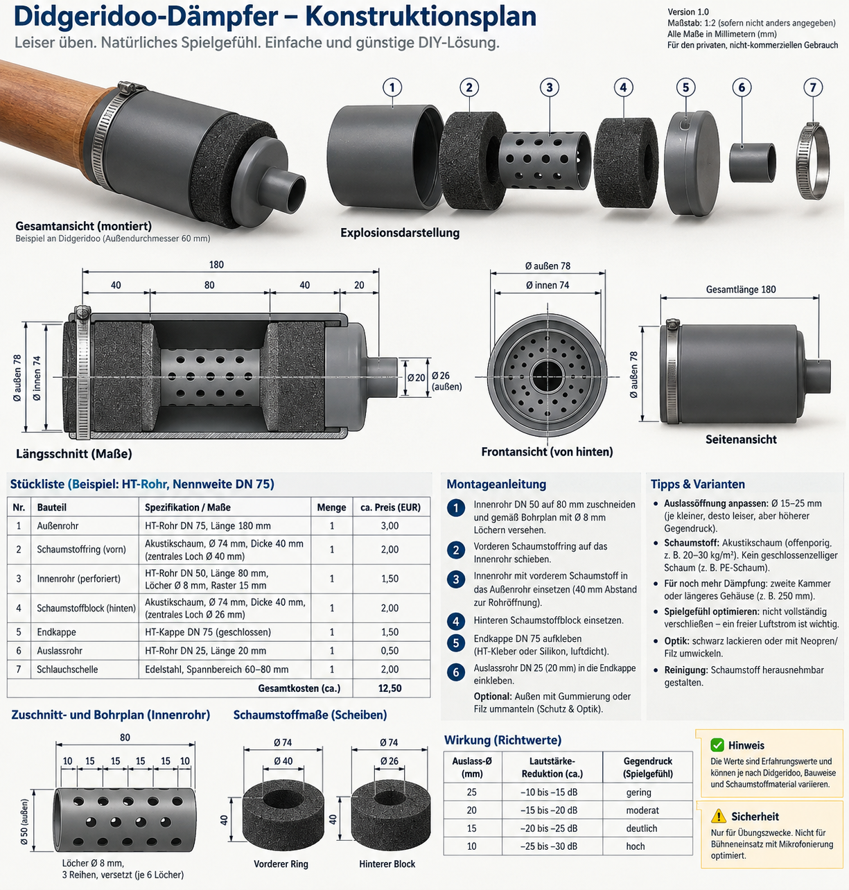

<p align="center">
  
</p>

<h1 align="center">Didgeridoo-Übungsdämpfer</h1>

<p align="center"><strong>Leiser üben. Mehr Musik.</strong></p>

<p align="center">DIY · Open Hardware · Experimentell</p>

<p align="center">
  <a href="./README.md">English</a> ·
  <a href="./README_DE.md">Deutsch</a>
</p>

Ein kompakter DIY-Schalldämpfer für leiseres Didgeridoo-Üben zu Hause.

Die Konstruktion verwendet **Expansionsraum, ein perforiertes Innenrohr und offenporigen Akustikschaum**, statt die Glocke einfach zu verschließen. Die Luft kann durch einen kleinen Auslass weiterströmen, damit sich das Spielgefühl weniger stark verändert als bei einem dichten Stopfen.

> Das Didgeridoo wird dadurch nicht vollständig lautlos. Es handelt sich um ein experimentelles Übungsdämpfer-Konzept.

> [!IMPORTANT]
>
> ## Experimentelle Open-Hardware-Konstruktion
>
> Dieses Repository dokumentiert einen **kompakten DN75-Konstruktionsplan** (Planversion 1.0).
>
> Es ist ein DIY-Übungsgerät, kein geprüftes akustisches, medizinisches oder Bühnenprodukt. Maße, Materialien und die Lautstärkeangaben auf der Zeichnung sind **Richtwerte**. Sie können sich nach unabhängigen Prototypversuchen ändern.
>
> Als nächste Schritte sind vorgesehen:
>
> * Bau eines oder mehrerer Prototypen nach diesem Plan
> * Beurteilung von Spielgefühl und Gegendruck
> * Schallpegelmessungen mit und ohne Dämpfer
> * Vergleich verschiedener Auslassdurchmesser
> * Versuche mit unterschiedlichen Schaumstoffen
> * Veröffentlichung von Messwerten und überarbeiteten Zeichnungen in diesem Repository
>
> Der aktuelle Stand ist **Konstruktionsplan v1.0 – experimentell**, nicht ein fertiges, laborvalidiertes Produkt.

---

## Aktueller Projektstatus

**Status:** Experimenteller DIY-Konstruktionsplan  
**Planversion:** 1.0  
**Maßgebliche Konstruktion:** kompakter HT-DN75-Dämpfer, Gesamtlänge 180 mm

Die Konstruktionszeichnung ist die Quelle für Teile und Maße. Der Text in dieser Datei ist daran angeglichen.

Eine frühere Skizze in diesem Repository beschrieb ein größeres DN125-Gehäuse mit etwa 400 mm Länge. Diese Geometrie ist **nicht** der aktuelle Bau. Längere oder größere Gehäuse bleiben optionale spätere Varianten.

---

## Vorgesehene Eigenschaften

* vollständig passiv — keine Elektronik
* kostengünstige, handelsübliche HT-Rohrteile
* austauschbarer offenporiger Akustikschaum
* perforiertes Innenrohr
* Schlauchschelle als Glockenkupplung für typische Übungsdidgeridoos
* austauschbarer / anbohrbarer Auslass
* möglichst geringer zusätzlicher Gegendruck bei größeren Auslässen
* vor allem Reduktion höherer Obertöne und Schnarrgeräusche
* einfach veränderbar für Versuche

---

## Vorgesehenes Funktionsprinzip

Ein Didgeridoo erzeugt einen starken tiefen Grundton und viele Obertöne.

Ein einfacher Verschluss senkt die Lautstärke, erhöht aber den Gegendruck stark und verändert das Spiel.

Dieser Dämpfer arbeitet in drei Stufen:

1. **Glockenkupplung und Expansionsraum**  
   Die Glocke wird mit einer Schlauchschelle am DN75-Gehäuse angekoppelt. Hinter der Glocke bleibt freies Volumen vor dem gelochten Rohr.

2. **Perforiertes Innenrohr**  
   Die Luft läuft durch ein kurzes DN50-Rohr mit versetzten Bohrungen. Schallenergie kann durch die Löcher in den umgebenden Schaum gelangen.

3. **Akustikschaum und offener Auslass**  
   Offenporiger Schaum nimmt einen Teil der Energie auf, besonders bei höheren Frequenzen. Ein DN25-Auslass hält den Luftweg offen.

Das Prinzip ist technisch plausibel. Wie gut genau diese kompakte Ausführung funktioniert, muss unabhängig gemessen und hier dokumentiert werden.

---

# Konstruktionsplan

Die deutsche Originalzeichnung ist der aktuelle Blueprint:

<p align="center">
  
</p>

<p align="center"><em>Konstruktionsplan v1.0 — kompakte DN75-Konstruktion. Alle Maße in Millimetern. Maßstab auf der Zeichnung 1:2, sofern nicht anders angegeben.</em></p>

Auf der Zeichnung steht noch der Hinweis „für den privaten, nicht-kommerziellen Gebrauch“. Dieser Hinweis wird durch die **Open-Hardware-Lizenz** dieses Repositories **ersetzt**. Siehe [Lizenz](#lizenz).

---

## Hauptabmessungen

Beispiel in der Zeichnung: Didgeridoo-**Außendurchmesser 60 mm**.

| Bauteil | Spezifikation |
| ------- | ------------- |
| Hauptgehäuse | HT-Rohr **DN75**, Länge **180 mm** |
| typischer Außendurchmesser | ca. **78 mm** |
| typischer Innendurchmesser | ca. **74 mm** |
| vorderer Schaumstoffring | Ø74 mm, Dicke **40 mm**, Mittelloch **Ø40 mm** |
| Innenrohr | HT-Rohr **DN50**, Länge **80 mm** |
| Bohrungen | **Ø8 mm**, Raster ca. **15 mm**, 3 versetzte Reihen à 6 Löcher |
| hinterer Schaumstoffblock | Ø74 mm, Dicke **40 mm**, Mittelloch **Ø40 mm** |
| Endkappe | HT-Kappe **DN75** |
| Auslassrohr | HT-Rohr **DN25**, Länge **20 mm** (innen ca. Ø20 mm, außen ca. Ø26 mm) |
| Schlauchschelle | Edelstahl, **60–80 mm** |
| Gesamtlänge | **180 mm** |

Axiale Aufteilung des 180-mm-Gehäuses:

```text
 40 mm          80 mm           40 mm      20 mm
 vorderer       Innenrohr       hinterer   Auslass
 Schaum                         Schaum
<--------------------- 180 mm --------------------->
```

**Diese Maße sind die aktuellen Ausgangswerte für den Prototypbau.** Sie sind in diesem Repository noch nicht unabhängig optimiert.

---

## Vorgesehener Längsschnitt

```text
 DIDGERIDOO                    DÄMPFER (DN75)

    Glocke ~Ø60
       ||     40 mm     80 mm          40 mm    20 mm
=======||================================================
Schelle||   [ Schaum] [ perforiertes DN50 ] [Schaum] | DN25 --> OUT
       ||   [ Ø40   ] [ Löcher Ø8 mm      ] [ Ø40  ] |
=======||================================================
              <------------- DN75 / 180 mm ------------>
```

---

# Materialien / Stückliste

Beispielpreise aus dem Konstruktionsplan (EUR, circa):

| Nr. | Bauteil | Spezifikation | Menge | ca. EUR |
| --: | ------- | ------------- | ----: | ------: |
| 1 | Außenrohr | HT-Rohr DN75, 180 mm | 1 | 3,00 |
| 2 | Schaumstoffring (vorn) | offenporiger Akustikschaum, Ø74 × 40 mm, Loch Ø40 mm | 1 | 2,00 |
| 3 | Innenrohr | HT-Rohr DN50, 80 mm, Löcher Ø8 mm, Raster 15 mm | 1 | 1,50 |
| 4 | Schaumstoffblock (hinten) | offenporiger Akustikschaum, Ø74 × 40 mm, Loch Ø40 mm | 1 | 2,00 |
| 5 | Endkappe | HT-Kappe DN75 | 1 | 1,50 |
| 6 | Auslassrohr | HT-Rohr DN25, 20 mm | 1 | 0,50 |
| 7 | Schlauchschelle | Edelstahl, 60–80 mm | 1 | 2,00 |
|  |  | **Gesamtkosten (ca.)** |  | **12,50** |

**Offenporigen Akustikschaum** verwenden (z. B. 20–30 kg/m³). Geschlossenzelliger PE-Schaum ist kein Ersatz.

Keine lose Glas- oder Steinwolle verwenden, da Fasern in den Luftstrom gelangen könnten.

---

# Glockenkupplung

Die Zeichnung verwendet eine **Schlauchschelle** um Gehäuse und Didgeridoo, kein hartes Klemmen gegen Kunststoffkanten.

Das Beispielinstrument hat **Ø60 mm außen**. Der Schellenbereich ist **60–80 mm**.

Für andere Glocken:

* kleinere oder größere Schelle
* dünne Schaum- oder Gummizwischenlage
* später: 3D-gedruckte oder EVA/EPDM-Adapter

Das Didgeridoo sollte nicht gegen scharfe Kunststoffkanten gepresst werden.

---

# Perforiertes Innenrohr

Laut Konstruktionsplan:

* HT DN50, Länge **80 mm**
* Lochdurchmesser **8 mm**
* Abstand entlang des Rohrs: 10 / 15 / 15 / 15 / 15 / 10 mm
* **3 versetzte Reihen, je 6 Löcher** (18 Bohrungen)

```text
   o     o     o
      o     o
   o     o     o
```

Die Lochfläche ist im Vergleich zum Rohrquerschnitt groß, daher sollten die Bohrungen selbst keinen starken Strömungswiderstand erzeugen. Das tatsächliche Druckverhalten muss gemessen werden.

---

# Einstellbarer Ausgang – Richtwerte

Der Standardauslass auf der Zeichnung ist **DN25 / 20 mm lang**.

Kleinere Auslässe sollen leiser sein und mehr Gegendruck erzeugen:

| Auslass-Ø | Lautstärke-Reduktion (Richtwert) | Gegendruck (Richtwert) |
| --------: | -------------------------------- | ---------------------- |
| 25 mm | −10 bis −15 dB | gering |
| 20 mm | −15 bis −20 dB | moderat |
| 15 mm | −20 bis −25 dB | deutlich |
| 10 mm | −25 bis −30 dB | hoch |

Diese Angaben stammen aus dem Konstruktionsplan und sind dort als **Erfahrungs- / Richtwerte** gekennzeichnet. Sie können je nach Didgeridoo, Schaum, Raum und Spielstärke schwanken.

Es sind **keine** unabhängigen Labormessungen dieses Repositories. Spätere hier gemessene dB-Werte werden ausdrücklich als Messergebnisse gekennzeichnet.

Den Auslass nicht vollständig verschließen. Ein freier Luftstrom ist für Spielgefühl und Sicherheit wichtig.

---

# Zusammenbau

1. DN75-Gehäuse auf **180 mm** schneiden.
2. DN50-Innenrohr auf **80 mm** schneiden.
3. Ø8-mm-Bohrungen gemäß Zeichnung anbringen (3 versetzte Reihen).
4. **Vorderen Schaumstoffring** auf das Innenrohr schieben.
5. Innenrohr mit vorderem Schaum in das Gehäuse setzen, etwa **40 mm** Abstand zur Vorderkante für die Glocke.
6. **Hinteren Schaumstoffblock** einsetzen.
7. DN75-Endkappe kleben (HT-Kleber oder Silikon; Kappenfuge dicht).
8. **20 mm DN25**-Auslass in die Endkappe kleben.
9. Schlauchschelle montieren. Optional außen mit Tape, Neopren oder Filz umwickeln.
10. Sicherstellen, dass kein Schaum in den Luftweg gelangt, und zuerst mit dem **größten** Auslass testen.

Der Schaumstoff sollte zum Trocknen und Reinigen herausnehmbar bleiben.

---

# Geplante Prototypversuche

Verglichen werden sollen mindestens:

```text
Test A: ohne Dämpfer
Test B: Auslass Ø25 mm
Test C: Auslass Ø20 mm
Test D: Auslass Ø15 mm
Test E: Auslass Ø10 mm
```

Für jede Konfiguration notieren:

* wahrgenommene Lautstärke
* Spielkomfort
* Gegendruck
* Ansprache des Grundtons
* Zirkularatmung
* Stimmeinsatz
* Obertöne
* Kondenswasserverhalten

---

# Geplante akustische Messungen

Möglichst konstante Bedingungen, zum Beispiel:

```text
Abstand:        1 Meter
Mikrofon:       gleiche Position
Raum:           gleicher Raum
Instrument:     gleiches Didgeridoo
Spielstärke:    möglichst konstant
```

Interessante Messwerte:

* durchschnittlicher dBA-Pegel
* maximaler dBA-Pegel
* Frequenzspektrum
* Pegel des Grundtons
* Pegel einzelner Obertöne
* Differenz mit und ohne Dämpfer

Messungen möglichst mehrfach wiederholen.

---

# Erwartete akustische Wirkung

Es wird keine zertifizierte Schalldämpfung behauptet.

Der kompakte Dämpfer dürfte **höhere Obertöne, Schnarren und Helligkeit** leichter beeinflussen als den sehr tiefen Grundton.

Mögliche Wirkungen:

* weniger Schnarren
* dunklerer / leiserer Übungsklang
* weniger Anschlag- und Atemgeräusche
* geringere wahrgenommene Lautstärke
* etwas mehr Gegendruck, besonders bei kleinen Auslässen

Wie stark diese Effekte in genau diesem Aufbau ausfallen, muss gemessen werden.

---

# Sicherheit

Dieses Projekt ist experimentell.

Nicht verwenden, wenn:

* der Luftstrom stark eingeschränkt wird
* das Atmen unangenehm wird
* hoher Druck entsteht
* Bauteile locker werden
* Absorbermaterial in den Luftstrom gelangen kann

Nur saubere, gesundheitlich unbedenkliche Materialien im Luftweg verwenden.

Der Dämpfer darf niemals einen luftdichten Verschluss bilden.

Der Konstruktionsplan kennzeichnet das Gerät als **Übungsdämpfer**, nicht als Bühnendämpfer für Mikrofonabnahme.

---

# Reinigung

Die Konstruktion sollte zerlegbar bleiben.

Da Kondenswasser entsteht:

* nach Gebrauch trocknen lassen
* Schaum möglichst herausnehmbar halten
* Innenrohr regelmäßig reinigen
* auf Schimmel kontrollieren
* verschmutzten Schaum ersetzen

---

# Geplante Weiterentwicklung

Mögliche spätere Varianten:

* andere Auslassdurchmesser (laut Zeichnung etwa 15–25 mm)
* längeres Gehäuse (z. B. DN75 × 250 mm) oder zweite Kammer
* 3D-gedruckte Glockenadapter
* wechselbare Schaumstoffkartuschen
* andere Gehäusedurchmesser, einschließlich eines größeren DN125-Versuchs
* Helmholtz- oder Viertelwellenresonatoren
* Kondenswasser-Auffang
* Low-Back-Pressure-Varianten

---

# Entwicklungsstufen

```text
v1.0-plan   kompakter DN75-Konstruktionsplan (aktuell)
     ↓
v1.1        erster physischer Prototyp nach diesem Plan
     ↓
v1.2        unabhängige akustische Messungen
     ↓
v1.3        Optimierung von Geometrie, Schaum und Auslass
     ↓
v2.0        getestete und dokumentierte Konstruktion
```

Die tatsächliche Entwicklung kann sich mit den Versuchsergebnissen ändern.

---

# Mitmachen

Eigene Prototypen sind ausdrücklich willkommen.

Besonders interessant:

* Fotos gebauter Dämpfer
* SPL-Messungen
* Frequenzspektren
* Gegendruckbeobachtungen
* andere Schäume und Maße
* 3D-druckbare Adapter
* Versuche mit verschiedenen Didgeridoos

Bitte klar unterscheiden zwischen **Entwurfsannahmen**, **subjektiven Beobachtungen** und **gemessenen Ergebnissen**.

---

# Haftungsausschluss

Dieses Repository enthält einen **experimentellen DIY-Konstruktionsplan**, kein zertifiziertes Produkt.

Die Verwendung eines Prototyps erfolgt auf eigene Verantwortung.

Es wird keine Garantie übernommen hinsichtlich:

* Schalldämpfung
* mechanischer Sicherheit
* Atemwiderstand
* Spielverhalten
* Kompatibilität mit bestimmten Instrumenten

---

# Lizenz

Hardware-Konstruktion, Zeichnungen und Dokumentation in diesem Repository stehen unter der **CERN Open Hardware Licence Version 2 – Permissive (CERN-OHL-P-2.0)**.

Das entspricht der Kennzeichnung **Open Hardware** im Projektlogo.

Auf der Konstruktionszeichnung steht noch der ältere Hinweis auf privaten, nicht-kommerziellen Gebrauch. Verbindlich ist die Repository-Lizenz oben.

Siehe die Datei [`LICENSE`](./LICENSE).

Später hinzukommende Software kann separat lizenziert werden.

---

## Dateien

| Datei | Rolle |
| ----- | ----- |
| [`docs/logo.png`](./docs/logo.png) | Projektlogo (transparent) |
| [`docs/logo.jpg`](./docs/logo.jpg) | Projektlogo (Original) |
| [`docs/construction-plan.png`](./docs/construction-plan.png) | Konstruktionsplan v1.0 (deutsches Original) |
| [`README.md`](./README.md) | englische Dokumentation |
| [`README_DE.md`](./README_DE.md) | deutsche Dokumentation |
| [`LICENSE`](./LICENSE) | CERN-OHL-P-2.0 |

**Nach dem Konstruktionsplan bauen, offen messen, und die dB-Tabelle als Richtwerte behandeln, bis in diesem Repository eigene Messungen liegen.**
